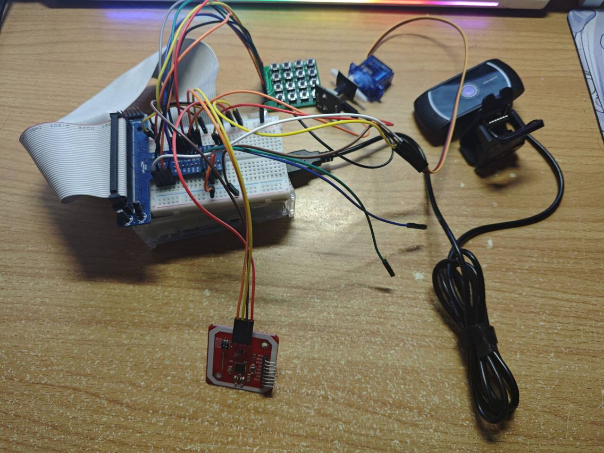
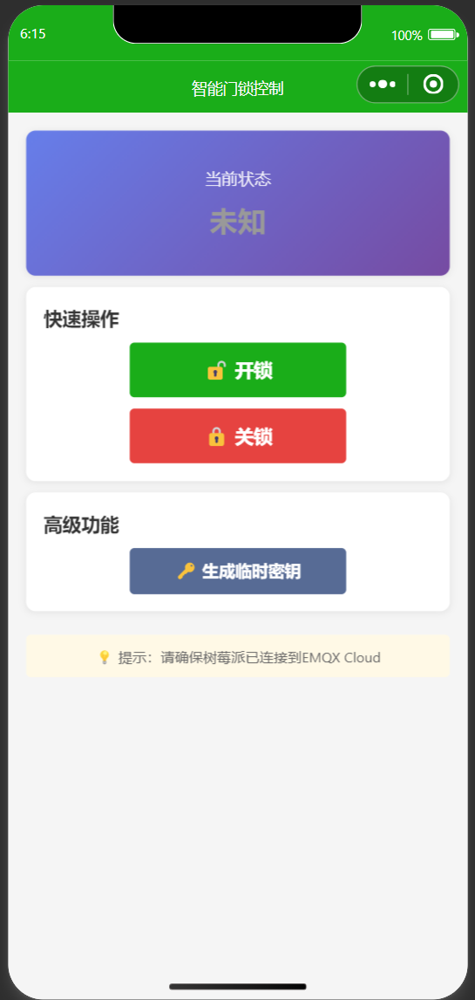

> 最近我完成了一个基于树莓派的智能门锁项目，作为一个涵盖嵌入式开发、后端服务和移动端开发的综合性项目，它非常适合用来练手。本文将详细介绍该系统的实现原理和开发过程。

## 实物图：



## 🔗 项目开源

本项目的所有代码（包括树莓派端 Python 代码、云端 Flask 服务、微信小程序）均已开源，欢迎 Star！

- **GitHub 仓库地址**：[https://github.com/nihuii/raspberry-pi-smart-lock](https://github.com/nihuii/raspberry-pi-smart-lock)

---

## 🛠️ 项目概述

这个智能门锁系统并不是简单的“舵机控制”，而是一个完整的物联网（IoT）解决方案。它主要实现了以下四种开锁方式：

1.  **人脸识别**：基于 OpenCV 和 Dlib，实现毫秒级的人脸比对。
2.  **NFC 刷卡**：支持标准 IC 卡/门禁卡解锁。
3.  **矩阵键盘密码**：支持虚位密码，防止窥视。
4.  **远程控制**：通过微信小程序远程查看状态、生成临时密钥和远程开锁。

### 系统架构图

整个系统分为三层架构：
* **感知层（树莓派）**：负责控制硬件传感器（摄像头、NFC、键盘、舵机）。
* **网络层（MQTT + HTTP）**：使用 MQTT 协议进行实时状态同步，HTTP 协议上传抓拍日志。
* **应用层（云服务器 + 小程序）**：部署 Flask 后端处理业务逻辑，微信小程序作为用户终端。

---

## 🔩 硬件清单

为了复刻这个项目，你需要准备以下核心硬件：

| 硬件名称                | 说明                               |
| :---------------------- | :--------------------------------- |
| **Raspberry Pi 4B/3B+** | 核心控制器，建议 2GB 内存以上      |
| **Pi Camera V2**        | 用于人脸识别抓拍                   |
| **PN532 NFC 模块**      | SPI/I2C 通讯，用于读取 IC 卡       |
| **4x4 矩阵薄膜键盘**    | 用于输入密码                       |
| **SG90 / MG996R 舵机**  | 模拟锁舌的开关动作                 |
| **5V 继电器 (可选)**    | 如果使用的是电磁锁，需要继电器驱动 |

---

## 💻 核心功能实现

### 1. 人脸识别 (Face Auth)

这是项目中最消耗算力的部分。为了提高效率，我使用了 `face_recognition` 库，它基于 dlib 的 HOG 特征提取。

我们在 `code/face_auth.py` 中预加载了已知人脸的数据：

```python
import face_recognition
import os

# 加载已知人脸库
def load_known_faces(known_faces_dir):
    known_face_encodings = []
    known_face_names = []

    for filename in os.listdir(known_faces_dir):
        if filename.endswith(".jpg") or filename.endswith(".png"):
            # 加载图片并编码
            image = face_recognition.load_image_file(f"{known_faces_dir}/{filename}")
            encoding = face_recognition.face_encodings(image)[0]
            
            known_face_encodings.append(encoding)
            # 文件名作为人名（如 CX.jpg -> CX）
            known_face_names.append(os.path.splitext(filename)[0])
            
    return known_face_encodings, known_face_names
```

在主循环中，系统会实时检测摄像头画面，一旦匹配度低于阈值（例如 0.4），即视为识别成功并驱动舵机开锁。

### 2. 多线程任务调度

由于树莓派需要同时监听键盘输入、NFC 刷卡和网络消息，单线程肯定会造成阻塞。在 `code/main_mqtt_pro.py` 中，我使用了 Python 的 `threading` 模块来并行处理任务：

Python

```
# 启动各个模块的监听线程
# 1. 启动键盘监听
keypad_thread = threading.Thread(target=run_keypad)
keypad_thread.daemon = True
keypad_thread.start()

# 2. 启动 NFC 监听
nfc_thread = threading.Thread(target=run_nfc)
nfc_thread.daemon = True
nfc_thread.start()

# 3. 启动 MQTT 消息监听
mqtt_thread = threading.Thread(target=mqtt_client.loop_forever)
mqtt_thread.daemon = True
mqtt_thread.start()
```

### 3. 云端通信与微信小程序

为了实现远程控制，树莓派通过 MQTT 协议连接到云服务器。当我们在小程序点击“开锁”时：

1. **小程序** 发送 HTTPS 请求给 **云服务器 (Flask)**。
2. **云服务器** 验证权限后，向 MQTT Broker 发布一条 `unlock` 指令。
3. **树莓派** 收到 MQTT 指令，执行开锁动作，并上传一条“远程开锁”的日志。

云端 Flask 代码片段 (`cloud_server/app.py`)：

Python

```
@app.route('/api/remote_unlock', methods=['POST'])
def remote_unlock():
    data = request.json
    if verify_token(data.get('token')):
        # 发送 MQTT 消息给树莓派
        mqtt_client.publish(MQTT_TOPIC_COMMAND, "OPEN_DOOR")
        return jsonify({"status": "success", "message": "开锁指令已发送"})
    return jsonify({"status": "error", "message": "权限验证失败"}), 403
```

小程序端界面展示了当前的门锁状态以及最近的开锁记录：


------

## 🚀 部署踩坑指南

在开发过程中遇到过不少坑，这里总结几点供大家参考：

### 环境依赖

树莓派安装 OpenCV 和 dlib 比较慢，建议换源后使用编译好的 wheel 包，或者直接运行项目中的安装脚本：

Bash

```
cd code
chmod +x install_dependencies.sh
./install_dependencies.sh
```

### 权限问题

操作 GPIO 和 SPI 接口（用于 NFC）通常需要 root 权限。如果遇到 `Permission denied`，请检查是否已将当前用户加入 `gpio` 和 `spi` 用户组，或者使用 `sudo` 运行脚本。

### MQTT 掉线重连

网络波动会导致 MQTT 断开，务必在代码中加入 `on_disconnect` 回调进行自动重连：

Python

```
def on_disconnect(client, userdata, rc):
    print("MQTT Disconnected. Trying to reconnect...")
    while True:
        try:
            client.reconnect()
            break
        except:
            time.sleep(5)
```

------

## 📝 总结

这个项目通过软硬结合，完整地走通了物联网开发的流程。从底层的 GPIO 控制，到中间的网络通信，再到上层的用户交互，每一个环节都充满了挑战和乐趣。

如果你对这个项目感兴趣，或者在复刻过程中遇到问题，欢迎在 GitHub 上提 Issue 或与我交流！

别忘了给仓库点个 Star 🌟：https://github.com/nihuii/raspberry-pi-smart-lock